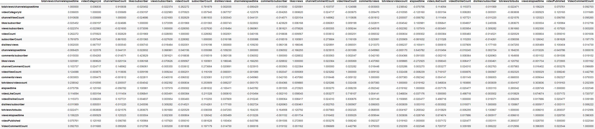

# 1111-DataMining-Final


## Dataset

[YouTube Videos and Channels Metadata](https://www.kaggle.com/datasets/thedevastator/revealing-insights-from-youtube-video-and-channe)


## Usage

### 1. Create Enviroments

+ Windows

  ```
  python -m venv venv
  venv\Scripts\activate
  pip install -r requirements.txt
  jupyter lab
  ```

### 2. Download Dataset

+ Download dataset from [YouTube Videos and Channels Metadata](https://www.kaggle.com/datasets/thedevastator/revealing-insights-from-youtube-video-and-channe)
+ Put `YouTubeDataset_withChannelElapsed.csv` under source folder

### 3. Open `data-mining.ipynb` On Jupyter


## Processing

### 1. Data Preprocessing

+ #### Unique: Set videoID to index and Drop duplicate data
    + Delete attributes ['index', 'likes/dislikes', 'channelId']

+ #### DropNA: Drop all null and meaningless values
    + Delete by row if attributes' value is -1 in data

+ #### TimeStamp: Transfer time format to timestamp
    + 2012-01-19T18:38:28.000Z -> 1326902400

### 2. Calculate Correlation

+ Use min-max scaling to normalization
+ Calculate Pearson correlation coefficient correlations

+ Correlation
    
