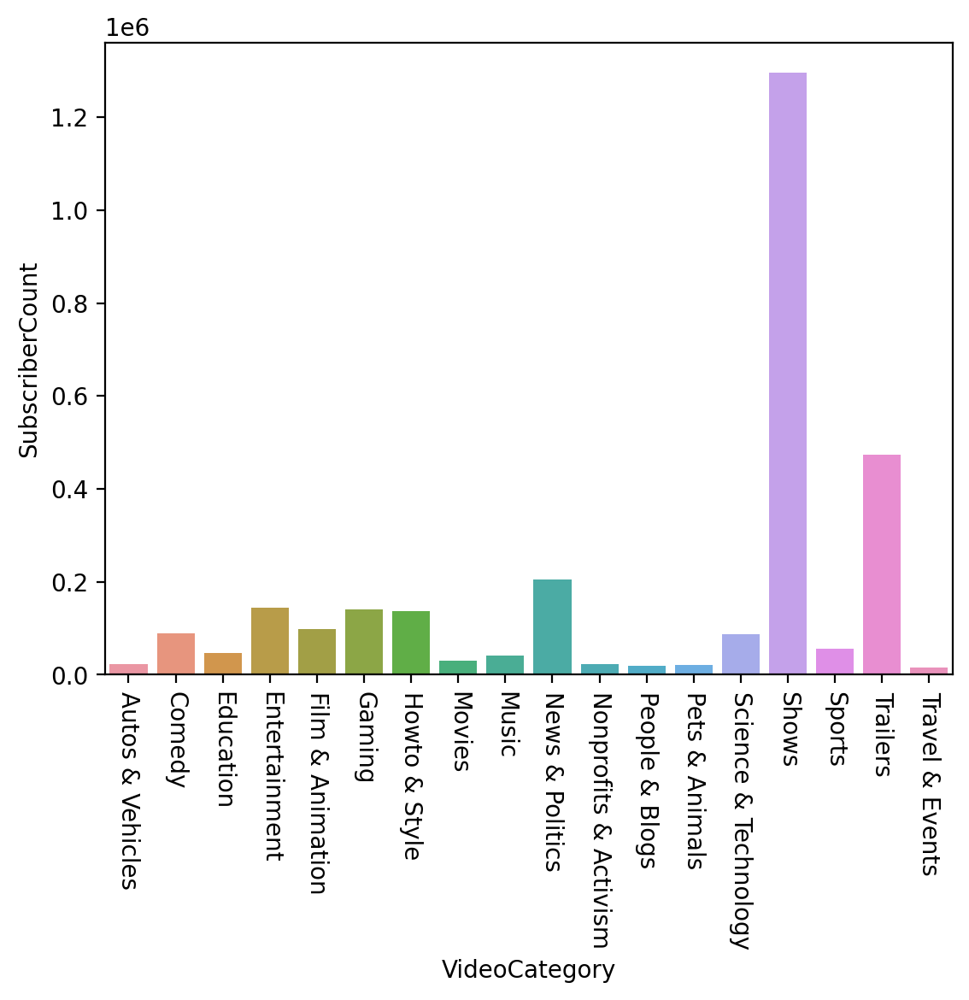

# Data Mining with Kaggle YouTube Videos and Channels Metadata


## Dataset

[YouTube Videos and Channels Metadata](https://www.kaggle.com/datasets/thedevastator/revealing-insights-from-youtube-video-and-channe)


## Usage

### 1. Create Enviroments

+ Windows

  ```
  python -m venv venv
  venv\Scripts\activate
  pip install -r requirements.txt
  jupyter lab
  ```

### 2. Download Dataset

+ Download dataset from [YouTube Videos and Channels Metadata](https://www.kaggle.com/datasets/thedevastator/revealing-insights-from-youtube-video-and-channe)
+ Put `YouTubeDataset_withChannelElapsed.csv` under source folder

### 3. Open `data-mining.ipynb` On Jupyter


## Processing

### 1. Data Preprocessing

+ #### Unique: Set videoID to index and Drop duplicate data
    + Delete attributes ['index', 'likes/dislikes', 'channelId']

+ #### DropNA: Drop all null and meaningless values
    + Delete by row if attributes' value is -1 in data

+ #### TimeStamp: Transfer time format to timestamp
    + 2012-01-19T18:38:28.000Z -> 1326902400

    

### 2. Calculate Correlation

+ Use min-max scaling to normalization
+ Calculate Pearson correlation coefficient correlations

+ #### Correlation
    
    
<!-- + #### Correlation Heatmap
     -->
    
+ #### Correlation Heatmap With Annotation
    

### 3. Scatter Plot Between Two Attributes

<!-- + #### VideoViewCount and SubscriberCount
     -->

+ #### ChannelViewCount and SubscriberCount
    
    
<!-- + #### VideoViewCount and SubscriberCount With Correlation
     -->

+ #### ChannelViewCount and SubscriberCount With Correlation
    
    

### 4. Analysis by VideoCategory and Bar Chart

+ Add attribute 'videoCategory' by 'videoCategoryID'
+ Group by VideoCategory

+ #### SubscriberCount
    

+ #### VideoCount
    
    
+ #### Views/Subscribers
    
    
+ #### SubscriberCount and VideoViewCount
    
    
+ #### SubscriberCount and VideoCommentCount
    


## Functions

+ ### Draw Heatmap
    ``` Python
    def draw_heatmap(data):
      # Use minmax to normalize (value between 0 ~ 1)
      normalizedDF_minmax = (data - data.min()) / (data.max() - data.min())
      normalizedDF_correlation = normalizedDF_minmax.corr()
      plt.figure(figsize=(30, 24))
      sns.heatmap(normalizedDF_correlation, cmap='RdBu_r', linewidths=0.5, vmin=-1, vmax=1, annot=True)
      plt.show()

    draw_heatmap(data)
    ```

+ ### Draw Scatter Plot
    ``` Python
    def draw_scatter(data, attributeName1, attributeName2):
      # Use minmax to normalize (value between 0 ~ 1)
      attribute1_minmax = (data[attributeName1] - data[attributeName1].min()) / (data[attributeName1].max() - data[attributeName1].min())
      attribute2_minmax = (data[attributeName2] - data[attributeName2].min()) / (data[attributeName2].max() - data[attributeName2].min())
      plt.scatter(list(attribute1_minmax), list(attribute2_minmax), s=3, c='red')
      plt.xlabel(attributeName1)
      plt.ylabel(attributeName2)
      plt.show()

    draw_scatter(data, 'channelViewCount', 'subscriberCount')
    ```

+ ### Draw Scatter With Line
    ``` Python
    def draw_scatter_with_line(data, attributeName1, attributeName2, x, y):
      # Use minmax to normalize (value between 0 ~ 1)
      attribute1_minmax = (data[attributeName1] - data[attributeName1].min()) / (data[attributeName1].max() - data[attributeName1].min())
      attribute2_minmax = (data[attributeName2] - data[attributeName2].min()) / (data[attributeName2].max() - data[attributeName2].min())
      plt.scatter(list(attribute1_minmax), list(attribute2_minmax), s=3, c='red')
      plt.plot(x, y)
      plt.xlabel(attributeName1)
      plt.ylabel(attributeName2)
      plt.show()

    x = np.linspace(0, 1); y = x
    draw_scatter_with_line(data, 'channelViewCount', 'subscriberCount', x, y)
    ```

+ ### Draw Scatter With Correlation
    ``` Python
    def draw_scatter_with_correlation(data, attributeName1, attributeName2):
      # Use minmax to normalize (value between 0 ~ 1)
      attribute1_minmax = (data[attributeName1] - data[attributeName1].min()) / (data[attributeName1].max() - data[attributeName1].min())
      attribute2_minmax = (data[attributeName2] - data[attributeName2].min()) / (data[attributeName2].max() - data[attributeName2].min())
      df = pd.DataFrame({
                  attributeName1: list(attribute1_minmax),
                  attributeName2: list(attribute2_minmax)
              })
      sns.lmplot(x=attributeName1, y=attributeName2, data=df, line_kws={'color': 'red'})
      plt.xlabel(attributeName1)
      plt.ylabel(attributeName2)
      plt.show()

    draw_scatter_with_correlation(data, 'channelViewCount', 'subscriberCount')
    ```
